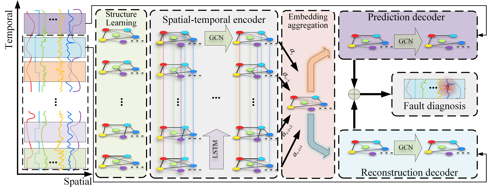
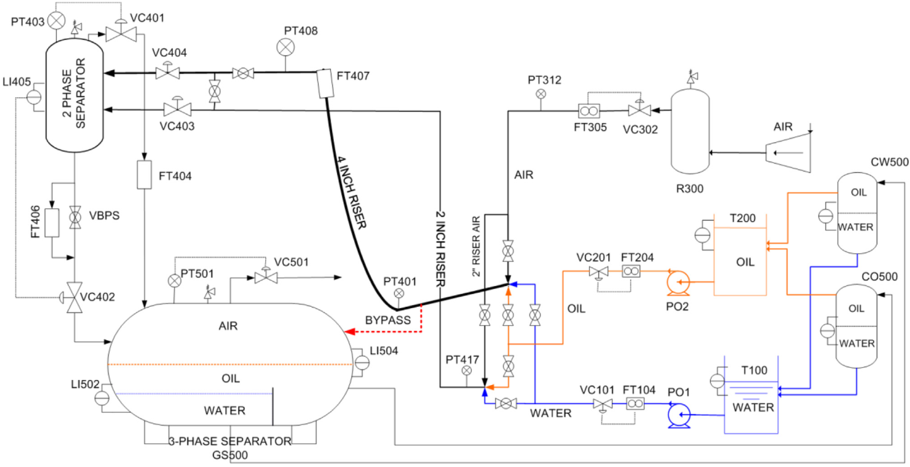
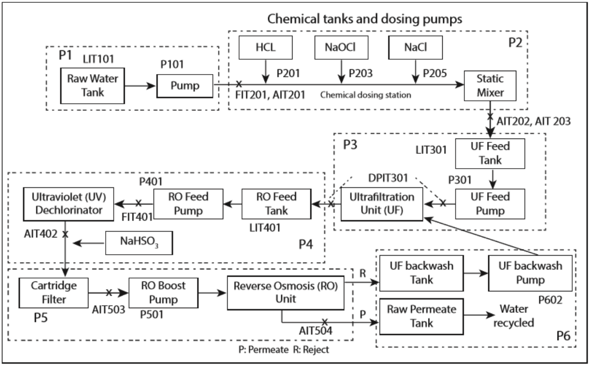

# STAGED: A Spatial-Temporal Aware Graph Encoder-Decoder for Fault Diagnosis in Industrial Processes

---
## Introduction
Data-driven fault diagnosis for critical industrial processes has exhibited promising 
potential with massive operating data from the supervisory control and data acquisition 
system. However, automatically extracting the complicated interactions between 
measurements and subtly integrating it with temporal evolutions have not been fully considered. 
Besides, with the increasing complexity of industrial processes, accurately locating fault roots
is of tremendous significance. We propose an unsupervised spatial-temporal aware
graph encoder-decoder (STAGED) model for industrial fault diagnosis. 


---
## Datasets

### [Cranfield Three-Phase Flow Facility (TPFF)](https://www.sciencedirect.com/science/article/pii/S0967066115000866)

If you want to know more about this dataset, please read the following paper.
```latex
@article{ruiz2015statistical,
  title={Statistical process monitoring of a multiphase flow facility},
  author={Ruiz-C{\'a}rcel, Cristobal and Cao, Yi and Mba, D and Lao, Liyun and Samuel, RT},
  journal={Control Engineering Practice},
  volume={42},
  pages={74--88},
  year={2015},
  publisher={Elsevier}
}
```



### [Secure Water Treatment (SWaT)](https://itrust.sutd.edu.sg/itrust-labs_datasets/dataset_info/)

If you want to know more about this dataset, please read the following paper.
```latex
@inproceedings{goh2017dataset,
  title={A dataset to support research in the design of secure water treatment systems},
  author={Goh, Jonathan and Adepu, Sridhar and Junejo, Khurum Nazir and Mathur, Aditya},
  booktitle={Critical Information Infrastructures Security: 11th International Conference, CRITIS 2016, Paris, France, October 10--12, 2016, Revised Selected Papers 11},
  pages={88--99},
  year={2017},
  organization={Springer}
}
```


---
## References
The baseline algorithms are listed below. You can click on its name to get corresponding repository on git-hub. Also, more details can be found from their papers.
* [MSCRED](https://github.com/Stream-AD/MemStream) 
```latex
@inproceedings{zhang2019deep,
  title={A deep neural network for unsupervised anomaly detection and diagnosis in multivariate time series data},
  author={Zhang, Chuxu and Song, Dongjin and Chen, Yuncong and Feng, Xinyang and Lumezanu, Cristian and Cheng, Wei and Ni, Jingchao and Zong, Bo and Chen, Haifeng and Chawla, Nitesh V},
  booktitle={Proceedings of the AAAI conference on artificial intelligence},
  volume={33},
  number={01},
  pages={1409--1416},
  year={2019}
}
```
* [MTAD-GAT](https://github.com/ML4ITS/mtad-gat-pytorch)
```latex
@inproceedings{zhao2020multivariate,
  title={Multivariate time-series anomaly detection via graph attention network},
  author={Zhao, Hang and Wang, Yujing and Duan, Juanyong and Huang, Congrui and Cao, Defu and Tong, Yunhai and Xu, Bixiong and Bai, Jing and Tong, Jie and Zhang, Qi},
  booktitle={2020 IEEE International Conference on Data Mining (ICDM)},
  pages={841--850},
  year={2020},
  organization={IEEE}
}
```
* [GDN](https://github.com/d-ailin/GDN)
```latex
@inproceedings{deng2021graph,
  title={Graph neural network-based anomaly detection in multivariate time series},
  author={Deng, Ailin and Hooi, Bryan},
  booktitle={Proceedings of the AAAI conference on artificial intelligence},
  volume={35},
  number={5},
  pages={4027--4035},
  year={2021}
}
```

* [STGAT-MAD](https://github.com/zhanjun717/STGAT)
```latex
@inproceedings{zhan2022stgat,
  title={Stgat-Mad: Spatial-Temporal Graph Attention Network For Multivariate Time Series Anomaly Detection},
  author={Zhan, Jun and Wang, Siqi and Ma, Xiandong and Wu, Chengkun and Yang, Canqun and Zeng, Detian and Wang, Shilin},
  booktitle={ICASSP 2022-2022 IEEE International Conference on Acoustics, Speech and Signal Processing (ICASSP)},
  pages={3568--3572},
  year={2022},
  organization={IEEE}
}
```
* [MemStream](https://github.com/Stream-AD/MemStream)
```latex
@inproceedings{bhatia2022memstream,
  title={MemStream: Memory-Based Streaming Anomaly Detection},
  author={Bhatia, Siddharth and Jain, Arjit and Srivastava, Shivin and Kawaguchi, Kenji and Hooi, Bryan},
  booktitle={Proceedings of the ACM Web Conference 2022},
  pages={610--621},
  year={2022}
}
```


